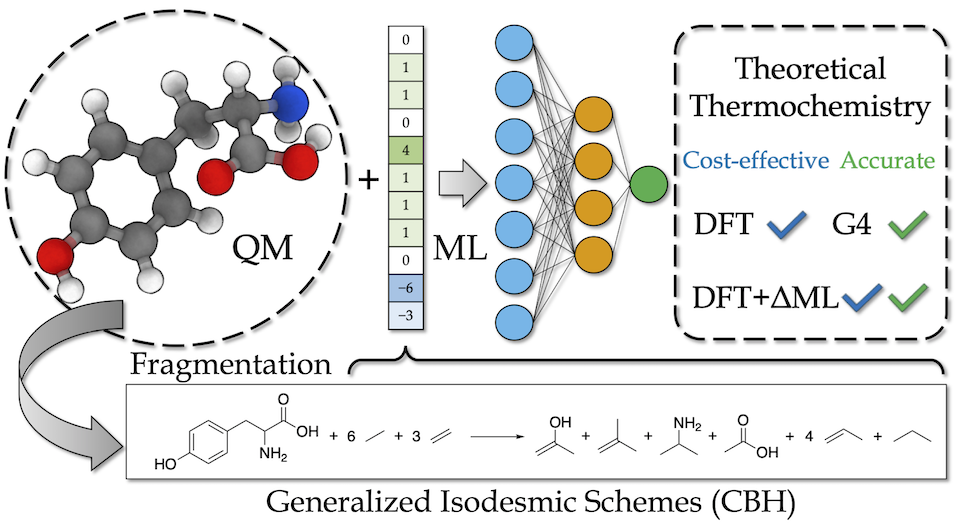

MLCBH: Effective Molecular Descriptors for Chemical Accuracy at DFT Cost
=======

MLCBH is a set of generalized molecular descriptors for machine learning combining ideas *fragmentation, error-cancellation, and machine learning.* These representations can be derived solely on the connectivity of the molecule using the fragmentation scheme of the [Connectivity Based Hierarchy (CBH)](https://doi.org/10.1021/ct200279q) of generalized isodemic reactions. 

This repository provides scripts to generate the representation and define ML model along with the **1k-G4-C9** dataset used in the MLCBH paper, which is comprised of G4 calculated ∆Hf(298K) of 1051 experimentally stable organic molecules with 9 or fewer carbon atoms.

*Authors:* 
- Eric M. Collins (Indiana University) colliner@iu.edu
- Krishnan Raghavachari (Indiana University) kraghava@iu.edu

### Performance of DFT+∆ML(CBH-2) models on full 1k-G4-C9

| Baseline    (DFT)   | Property | MAE  (kcal/mol)  |
|--------------|----------|----------|
| B3LYP        | ∆Hf(298K)|     0.59 |
| B3LYP-D3(BJ) | ∆Hf(298K)|     0.36 |
| ωB97X-D      | ∆Hf(298K)|     0.40 |
| B2PLYP-D3(BJ)| ∆Hf(298K)|     0.43 |

# Installation

`git clone https://github.com/colliner/MLCBH`

## Requirements

`smiles2cbh/smiles2cbh.py` is a python script to generate the MLCBH input representations and requires a number of dependencies:

- `python3`
- `numpy`
- [`fragreact`](https://github.com/jensengroup/fragreact) a Python package for the fragmentation and generation of the generalized isodesmic reactions

`network/MLPRegressor.py` is a python script defining the MLCBH-2 model used in this study and requires:

- `python3`
- [`scikit-learn`](https://scikit-learn.org/stable/install.html) a free machine learning library for the Python
- `numpy`
- `scipy`
